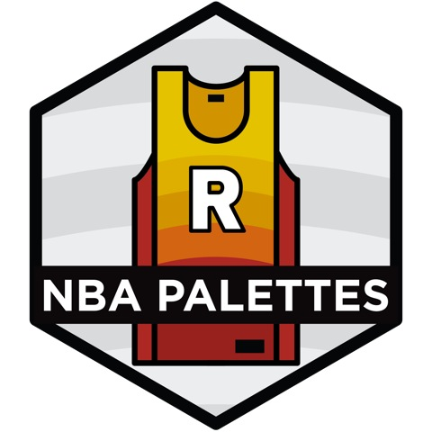
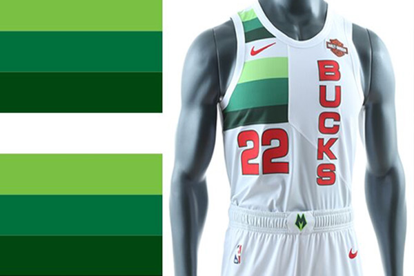

<!-- README.md is generated from README.Rmd. Please edit that file -->

```{r, include = FALSE}
knitr::opts_chunk$set(
   collapse = TRUE,
  comment = "#>",
  fig.path = "man/figure/",
  fig.height = 1
)
```


<!-- badges: start -->
[](https://travis-ci.org/murrayjw/nbapalettes)
<!-- badges: end -->
  
# NBA Palettes 



This package is based on the amazing [wesanderson](https://github.com/karthik/wesanderson) package. It includes color palettes taken from a large variety of NBA jersey colorways. These can be used to [Spicy P](https://twitter.com/pskills43/status/1337063497469997058/photo/1) up your plots. The package currently contains 129 different palettes. 

## Installation

```r
devtools::install_github('murrayjw/nbapalettes')
```


## Usage

```{r, palettes_dummy}
library("nbapalettes")

# See available palettes
available_palettes()
```

## Palettes

The package currently contains 129 palettes based on various NBA jerseys from every current NBA team and a few of former teams (Bobcats, Supersonics, New Orleans Hornets). 

## Denver Nuggets

The structure of the palette names is: teamname_jerseytype. For example to see the
Utah Jazz city colors for this season:

```{r, nuggets}
nba_palette("nuggets_city2")
```


### Utah Jazz 


```{r, jazz}
nba_palette("jazz_city")
```


### Toronto Raptors

```{r, royal}
nba_palette("raptors_original")
nba_palette("raptors_military")
```


### Miami Heat

The package comes with team results from the 2020 NBA season (obtained using `nbastatR::game_logs()` from the [nbastatR package](http://asbcllc.com/nbastatR/)).

```{r, ggplot1, fig.height = 3, warning=F, message=F}
library("ggplot2")
library("dplyr")
data(nba_results2020)

nba_results2020 %>% 
   filter(nameTeam == 'Miami Heat') %>% 
   ggplot(aes(ptsTeam, fill = factor(isWin))) + 
   geom_density()+
   scale_fill_manual(values = nba_palette("heat"))

```


`nba_palette()` takes an argument `type` which can be either continuous or discrete. 

```{r ggplot2, fig.height = 3}

pal <- nba_palette("heat_vice", 100, type = "continuous")

nba_results2020 %>% 
  ggplot(aes(pctFG2Team, pctFG3Team)) +
  geom_point(aes(colour = ptsTeam)) +
  scale_colour_gradientn(colours = pal) +
  theme_minimal()

```


### More examples

```{r, bucks_earned}
nba_palette("bucks_earned")
```



```{r, bucks_ciy}
nba_palette("bucks_city2")
```

```{r, bobcats}
nba_palette("bobcats")
```

```{r, grizzlies_retro}
nba_palette("grizzlies_retro")
nba_palette("grizzlies_retro", 'continuous', n = 100)
```

```{r, sixers_city}
nba_palette("sixers_city")
```

```{r warriors}
nba_palette("warriors")
nba_palette("warriors_00s")
```

### Combining Palettes

Palettes can be combined by passing a vector of palette names

```{r warriors_combined}
nba_palette(c("warriors", "warriors_00s"))
```
