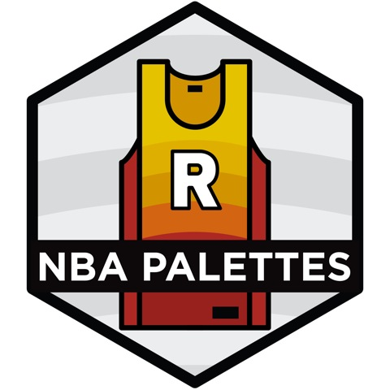
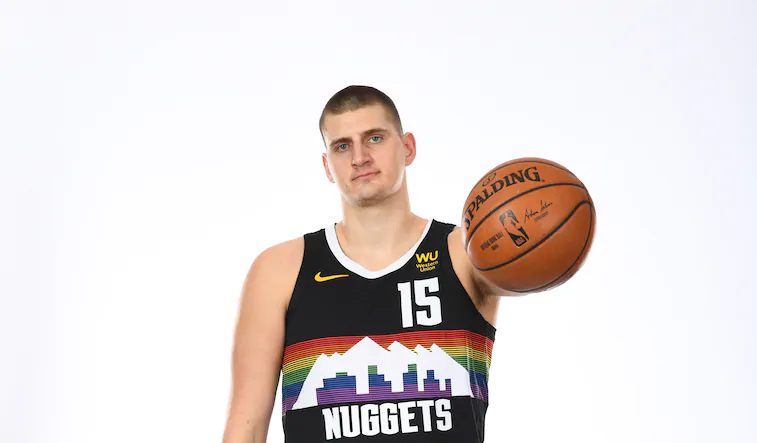
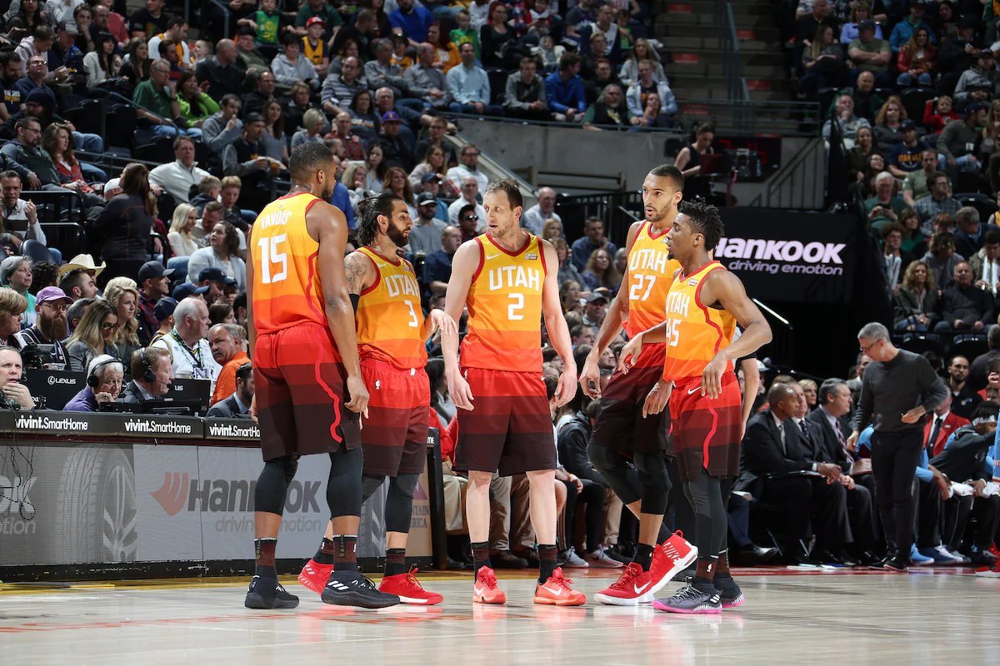
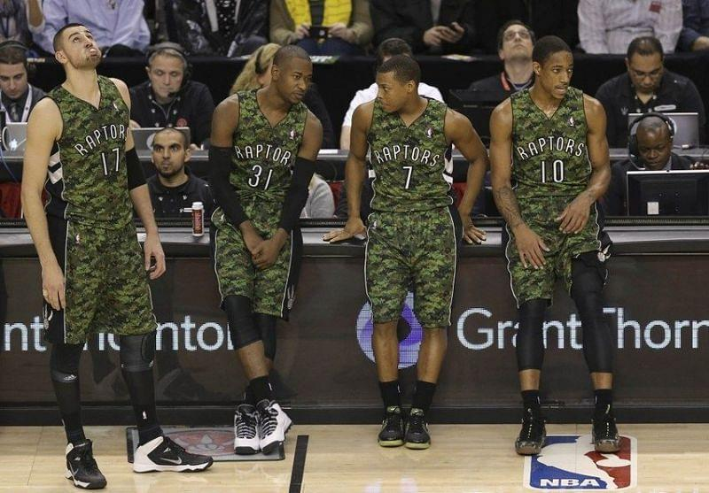
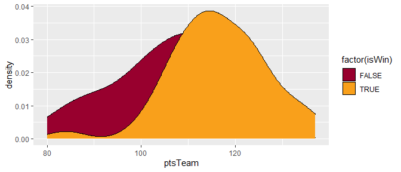
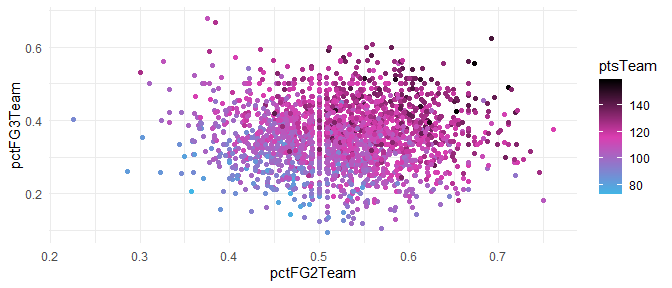
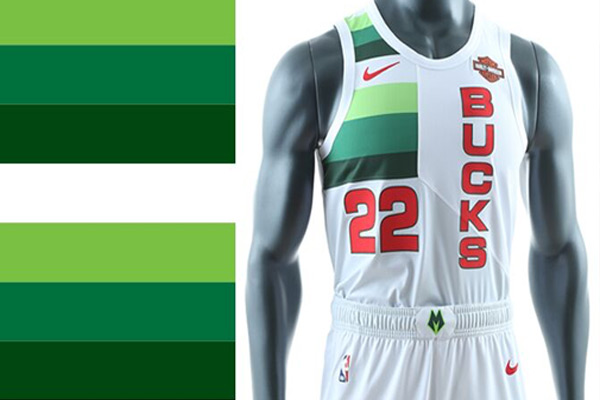

<!-- README.md is generated from README.Rmd. Please edit that file -->

# NBA Palettes



This package is based on the amazing
[wesanderson](https://github.com/karthik/wesanderson) package. It
includes color palettes taken from a large variety of NBA jersey
colorways. These can be used to [Spicy
P](https://twitter.com/pskills43/status/1337063497469997058/photo/1) up
your plots. The package currently contains 129 different palettes.

## Installation

``` r
devtools::install_github('murrayjw/nbapalettes')
```

## Usage

``` r
library("nbapalettes")

# See available palettes
available_palettes()
#> # A tibble: 129 x 3
#>    teams   palette_names     palette_colors                                     
#>    <chr>   <chr>             <chr>                                              
#>  1 bobcats bobcats           #0C2340, #418FDE, #1B365D, #E35205, #888B8D        
#>  2 bobcats bobcats_original  #F9423A, #1B365D, #8D9093, #010101                 
#>  3 blazers blazers           #E13A3E, #C4CED4, #000000                          
#>  4 blazers blazers_statement #C8102E, #010101, #373A36                          
#>  5 blazers blazers_city      #fea30c, #203b7e, #0881c6, #cf152d, #df4826        
#>  6 blazers blazers_city2     #2E2E2E, #140C0B, #C72830, #EC3036                 
#>  7 bucks   bucks             #00471B, #EEE1C6, #0077C0, #000000                 
#>  8 bucks   bucks_earned      #7AC043, #00713D, #014711, #CB0423, #D7D7D7, #FFFF~
#>  9 bucks   bucks_00s         #AC1A2F, #274E37, #95999D                          
#> 10 bucks   bucks_retro       #2C5234, #00843D, #6CC24A, #DE7C00, #010101        
#> # ... with 119 more rows
```

## Palettes

The package currently contains 129 palettes based on various NBA jerseys
from every current NBA team and a few of former teams (Bobcats,
Supersonics, New Orleans Hornets).

## Denver Nuggets

The structure of the palette names is: teamname\_jerseytype. For example
to see the Utah Jazz city colors for this season:

``` r
nba_palette("nuggets_city2")
```

<!-- -->



### Utah Jazz

``` r
nba_palette("jazz_city")
```

<!-- -->



### Toronto Raptors

``` r
nba_palette("raptors_original")
```

<!-- -->

``` r
nba_palette("raptors_military")
```

<!-- -->



### Miami Heat

The package comes with team results from the 2020 NBA season (obtained
using `nbastatR::game_logs()` from the [nbastatR
package](http://asbcllc.com/nbastatR/)).

``` r
library("ggplot2")
library("dplyr")
data(nba_results2020)

nba_results2020 %>% 
   filter(nameTeam == 'Miami Heat') %>% 
   ggplot(aes(ptsTeam, fill = factor(isWin))) + 
   geom_density()+
   scale_fill_manual(values = nba_palette("heat"))
```

<!-- -->

`nba_palette()` takes an argument `type` which can be either continuous
or discrete.

``` r

pal <- nba_palette("heat_vice", 100, type = "continuous")

nba_results2020 %>% 
  ggplot(aes(pctFG2Team, pctFG3Team)) +
  geom_point(aes(colour = ptsTeam)) +
  scale_colour_gradientn(colours = pal) +
  theme_minimal()
```

<!-- -->

### More examples

``` r
nba_palette("bucks_earned")
```

<!-- -->



``` r
nba_palette("bucks_city2")
```

<!-- -->

``` r
nba_palette("bobcats")
```

<!-- -->

``` r
nba_palette("grizzlies_retro")
```

<!-- -->

``` r
nba_palette("grizzlies_retro", 'continuous', n = 100)
```

<!-- -->

``` r
nba_palette("sixers_city")
```

<!-- -->

``` r
nba_palette("warriors")
```

<!-- -->

``` r
nba_palette("warriors_00s")
```

<!-- -->

### Combining Palettes

Palettes can be combined by passing a vector of palette names

``` r
nba_palette(c("warriors", "warriors_00s"))
```

<!-- -->
